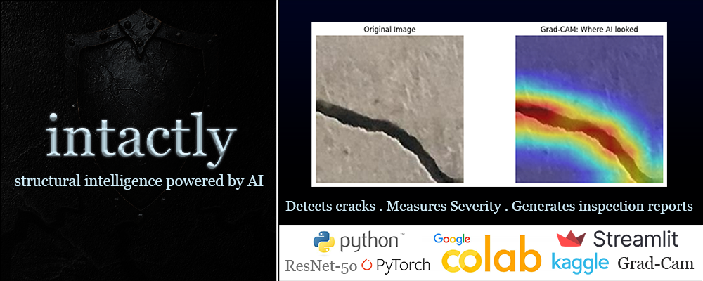

# Intactly

### Structural intelligence powered by AI

Intactly is an AI-powered infrastructure inspection system that detects structural cracks in concrete surfaces, visualises damage using Grad-CAM interpretability, and generates severity scores with maintenance recommendations. Built with PyTorch, ResNet-50, and Streamlit.

---

## Live Demo
🔗 [Try Intactly here](https://intactly.streamlit.app)

---

## What it does

Upload a close-up image of any concrete or stone surface and Intactly will:

- **Detect** whether a structural crack is present
- **Visualise** exactly where the AI looked using Grad-CAM heatmaps
- **Score** the severity of the crack on a 1–10 scale
- **Recommend** a maintenance action based on the severity
- **Log** all inspections in a session history dashboard

---

## How it works

The model is a ResNet-50 convolutional neural network pre-trained on ImageNet and fine-tuned on 40,000 concrete surface images (20,000 cracked, 20,000 non-cracked) from a public dataset. Transfer learning was used to adapt the model's existing knowledge of visual features to the specific task of crack detection.

After training for 5 epochs, the model achieved **99.9% validation accuracy**.

### Interpretability — Grad-CAM
Rather than treating the model as a black box, Intactly uses Gradient-weighted Class Activation Mapping (Grad-CAM) to generate a heatmap over the input image showing which regions influenced the model's decision. Red zones indicate high attention; blue zones indicate low attention.

### Severity Scoring
Severity is calculated from the Grad-CAM activation map — the percentage of the image flagged as high-activation determines a 1–10 score, with 10 reserved for surfaces where over 70% of the area shows crack activity.

---

## Key findings during development

**Severity miscalibration** — The initial threshold-based scoring system underestimated severity on heavily cracked surfaces. Diagnosed and fixed by switching to a coverage-based scoring system derived directly from the Grad-CAM activation map.

**Domain shift** — The model correctly classifies close-up concrete images but struggles with wide-angle or low-contrast wall photos. Grad-CAM still highlights crack regions correctly in these cases, suggesting the features are detected but fall below the classification threshold. Documented as a known limitation.

**Logic error in maintenance assessment** — Surfaces classified as crack-free were incorrectly displaying minor crack recommendations due to severity score bleed-through. Fixed by decoupling the maintenance message from the severity metric when no crack is predicted.

---

## Potential Applications

Intactly in its current form is a proof of concept trained on close-up concrete surface images. The underlying approach — CNN-based detection combined with Grad-CAM interpretability and severity scoring — could extend toward:

**Civil Infrastructure**
Routine monitoring of concrete bridges, dams, and tunnels. Early crack detection prevents catastrophic structural failures and reduces the cost of reactive repairs.

**Pavement & Roads**
Automated road surface surveys using vehicle-mounted cameras to detect potholes and cracking patterns, reducing traffic disruptions and maintenance costs.

**Manufacturing & Quality Control**
Real-time scanning of manufactured parts and metal surfaces to identify imperfections before products leave the factory floor.

Scaling to these domains would require more diverse training data and likely more robust architectures — but the core pipeline would remain the same.

---

## Tech stack

| Tool | Purpose |
|------|---------|
| PyTorch | Model training and inference |
| ResNet-50 | CNN architecture via transfer learning |
| Grad-CAM | Interpretability and heatmap generation |
| Streamlit | Web application framework |
| Google Colab | Training environment with GPU |
| Kaggle | Dataset source |

---

## Dataset
Surface Crack Detection dataset — 40,000 images (Kaggle, arunrk7)

---

## Built by
Ishan Dabral
